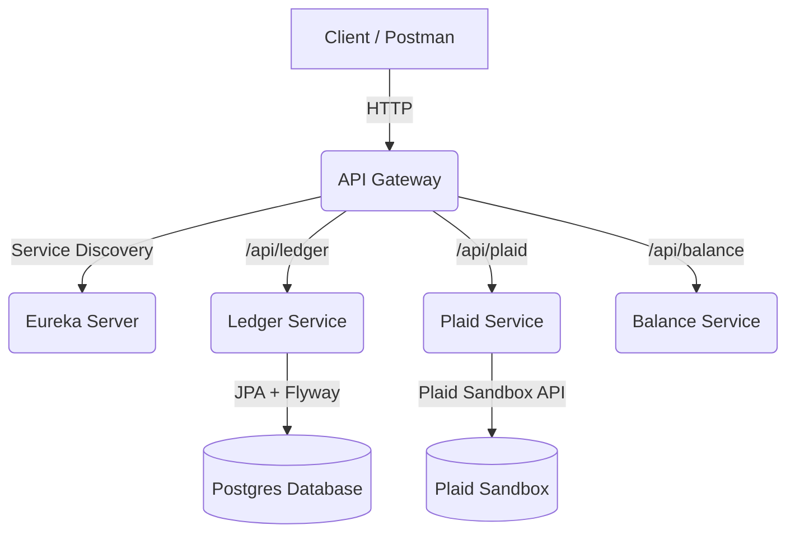
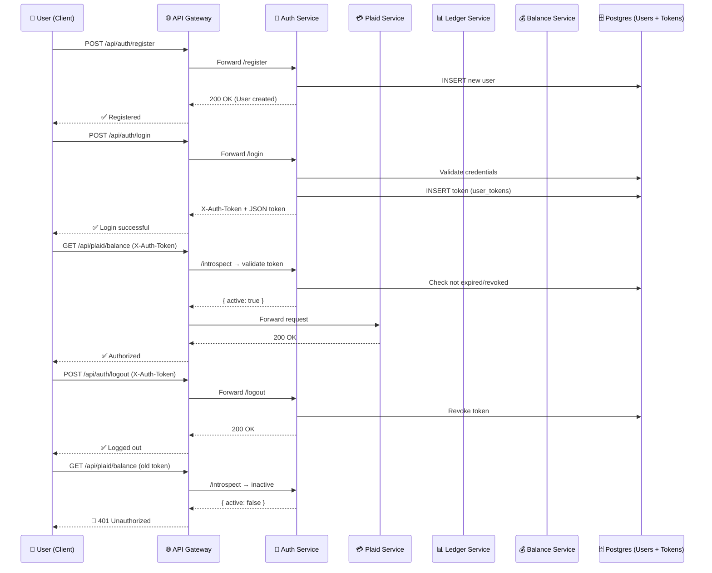

# 🧩 Balance Predictor

[](https://github.com/pa-mi-su/balance-predictor/actions/workflows/ci.yml)
[]()
[](LICENSE)
[]()
[]()
[]()

> **Balance Predictor** is a **microservices-based financial forecasting system** that predicts future account balances by combining **Plaid banking data** with **user transaction history**.
> Built with **Java 17**, **Spring Boot**, **Spring Cloud Eureka**, **Docker**, and **PostgreSQL**, it models the architectural principles found in real-world enterprise platforms.

---

## 🌟 Highlights

| Capability | Description |
|-------------|--------------|
| 🧭 **Microservice Architecture** | Independent services (Ledger, Balance, Plaid, Gateway, Eureka) communicating through REST + Service Discovery. |
| 🔗 **Plaid Sandbox Integration** | Live connection to Plaid’s Sandbox API for token creation, exchange, and balance retrieval. |
| 🧮 **Balance Forecasting Engine** | Aggregates real account balances with ledger events to project future funds. |
| 🧱 **Persistent Ledger** | Durable event storage in PostgreSQL 16 using **Spring Data JPA** and **Flyway** migrations. |
| 🚪 **API Gateway** | Central entry point with **Spring Cloud Gateway** and Eureka-based load-balanced routing. |
| ⚙️ **Docker-Compose Stack** | One-command startup for all containers (Eureka, Postgres, Ledger, Plaid, Balance, Gateway). |
| 📘 **Swagger + Postman** | Auto-documented APIs and one-click end-to-end testing via a bundled Postman collection. |
| 🔄 **Idempotent Writes** | Guaranteed safe re-submission of events via app- and DB-level deduplication. |
| 🧰 **CI/CD Ready** | Automated builds and multi-service Docker image packaging with GitHub Actions. |

---

## 🧠 Why This Project

Modern personal finance apps struggle with delayed balance updates and poor forecasting. **Balance Predictor** bridges that gap by:
- Synchronizing live Plaid balances with user-recorded ledger events.
- Calculating short-term projections to prevent overdrafts.
- Demonstrating a full microservice pattern with service discovery, resilience, and observability baked in.

This project serves as a **portfolio-ready reference architecture** for cloud-native Java developers.

---

## 🧭 Architecture Overview



### ⚙️ Service Ports

| Service | Port | Purpose |
|----------|------|----------|
| **Eureka Server** | `8761` | Service registry |
| **API Gateway** | `8081` | Single ingress for clients |
| **Balance Service** | `8080` | Projection engine |
| **Ledger Service** | `8082` | Persistent events |
| **Plaid Service** | `8083` | Sandbox bank integration |
| **Postgres** | `5432` | Shared relational database |

---

## 🐳 Quick Start (Docker Compose)

```bash
docker compose down -v
docker compose up -d --build
curl http://localhost:8081/actuator/health
```

### Verify All Services

```bash
docker compose ps
```
Expected healthy state:
```
NAME                                STATUS
api-gateway                         healthy
ledger-service                      healthy
plaid-service                       healthy
balance-service                     healthy
eureka-server                       healthy
postgres                            healthy
```

---

## 🧮 Idempotent Ledger Writes

Duplicate financial events can wreak havoc on projections.
**Ledger Service** guarantees **idempotency** both at the application and database level.

```sql
CREATE UNIQUE INDEX uq_pending_events_natural
  ON pending_events(user_id, event_date, amount, description);
```

- **App Guard:** `existsByUserIdAndDateAndAmountAndDescription()` prevents duplicates before insert.
- **DB Constraint:** unique index ensures absolute integrity.
- **Result:** safe retries, durable writes, consistent projections.

---

## 📊 Observability

| Tool | Description |
|------|--------------|
| **Spring Actuator** | `/actuator/health`, `/actuator/info`, `/actuator/gateway/routes` for discovery & health. |
| **Micrometer / Prometheus** | Ready for metrics collection and dashboarding. |
| **Resilience4j (Optional)** | Add for retries, circuit breaking, and fallback patterns. |

---

## 👩‍💻 Tech Stack

| Layer | Tech |
|-------|------|
| Language | Java 17 |
| Framework | Spring Boot 3.3.3 |
| Service Discovery | Spring Cloud Eureka 2023.0.3 |
| API Gateway | Spring Cloud Gateway |
| Database | PostgreSQL 16 + Flyway |
| Persistence | Spring Data JPA + HikariCP |
| Containerization | Docker + Compose |
| Testing | Postman + cURL + Testcontainers (future) |
| CI/CD | GitHub Actions |
| Docs | Swagger UI + Markdown |

---

---

# 🔐 Auth & Security Overhaul – Balance Predictor Microservices


---

## 🧩 Overview
This update delivers **end-to-end security** across all Balance Predictor microservices.
The platform now uses **opaque tokens** for authentication and **gateway-level authorization** — ensuring every route is locked down unless you’re logged in.

### 🚀 Highlights
- 🔐 **Opaque Token Authentication** stored in Postgres (`user_tokens`)
- 🌐 **Gateway Enforcement** – all routes blocked unless authenticated
- 🧠 **Central Auth Service** – issues, introspects, and revokes tokens
- ⚙️ **Stateless Microservices** – each service validates via `/introspect`
- 🐳 **Dockerized** with health checks for Eureka, Postgres, and Auth
- 🗄️ **Flyway Migration Sync** – uniform schema evolution across services

---

## 🧱 Core Components
| Component | Purpose |
|------------|----------|
| **AuthController** | Handles registration, login, logout, and token introspection |
| **TokenService** | Issues, validates, and revokes opaque tokens |
| **TokenAuthFilter** | Intercepts every request and validates the token |
| **WebSecurityConfig** | Denies all access unless logged in |
| **UserToken Entity** | Stores token metadata, expiration, and revocation state |

---

## 🧪 Example API Flow (via API Gateway)

Below is a full **end-to-end authentication flow** using simple `curl` commands.
It demonstrates how tokens are issued, validated, and required for all downstream services.

### 1️⃣ Register a new user
```bash
curl -s -X POST 'http://localhost:8081/api/auth/register' \
  -H 'Content-Type: application/json' \
  -d '{"username":"testuser","email":"testuser@example.com","password":"password123"}'
```
**Response**
```json
{ "id": 1, "username": "testuser", "email": "testuser@example.com" }
```

---

### 2️⃣ Log in to receive your opaque token
```bash
curl -i -s -X POST 'http://localhost:8081/api/auth/login' \
  -H 'Content-Type: application/json' \
  -d '{"username":"testuser","password":"password123"}'
```
**Response Headers**
```
X-Auth-Token: 0PQ43DBINSvvAIYKtZN1800astYT2a6Ds8t1qAqaJHg
```
**Response Body**
```json
{
  "userId": 1,
  "username": "testuser",
  "token": "0PQ43DBINSvvAIYKtZN1800astYT2a6Ds8t1qAqaJHg",
  "message": "Login successful"
}
```

---

### 3️⃣ Access a protected route
```bash
TOKEN="0PQ43DBINSvvAIYKtZN1800astYT2a6Ds8t1qAqaJHg"

curl -i 'http://localhost:8081/api/plaid/balance?userId=1' \
  -H "X-Auth-Token: $TOKEN"
```
**Response**
```json
{ "message": "Exchange a public_token first for this userId.", "error": "NO_ACCESS_TOKEN" }
```
✅ *Access granted!* The gateway validated your token and forwarded to the Plaid Service.

---

### 4️⃣ Try without a token (should fail)
```bash
curl -i 'http://localhost:8081/api/plaid/balance?userId=1'
```
**Response**
```
HTTP/1.1 401 Unauthorized
```
🚫 *Access denied* — all routes are locked down by default.

---

### 5️⃣ Logout (token revoked)
```bash
curl -i -X POST 'http://localhost:8081/api/auth/logout' \
  -H "X-Auth-Token: $TOKEN"
```
**Response**
```json
{ "message": "Logged out" }
```

---

### ✅ Flow Summary
| Step | Endpoint | Description | Auth Required |
|------|-----------|--------------|----------------|
| 1️⃣ | `/api/auth/register` | Create new account | ❌ No |
| 2️⃣ | `/api/auth/login` | Obtain token | ❌ No |
| 3️⃣ | `/api/plaid/balance` | Access protected resource | ✅ Yes |
| 4️⃣ | `/api/auth/logout` | Revoke token | ✅ Yes |

> 🔒 **Result:** All services are now secured behind token validation via the API Gateway.

---

## 🔄 Authentication Sequence Diagram



---

## 🧠 Final Summary
✅ Secure login/logout lifecycle using opaque tokens
✅ Gateway authorization for all protected endpoints
✅ Stateless validation through `/introspect`
✅ Seamless container orchestration with health checks
✅ Ready for production-grade microservice scaling

> 💡 **Architecture Goal:** A polished, security-first microservice system designed for scalability, modularity, and clarity — ideal for both enterprise-grade deployment and portfolio demonstration.

---

## 💣 Full Reset & Rebuild (Nuke Everything 🔁)

When things get messy or schema changes break Flyway, use this to completely **wipe and rebuild** your entire environment — containers, networks, volumes, and images.

```bash
# Stop and remove all running containers
docker compose down --remove-orphans

# Remove all project images (auth, gateway, ledger, balance, plaid, etc.)
docker rmi $(docker images "auth-service:local" -q) \
  $(docker images "api-gateway:local" -q) \
  $(docker images "ledger-service:local" -q) \
  $(docker images "balance-service:local" -q) \
  $(docker images "plaid-service:local" -q) \
  $(docker images "eureka-server:local" -q) 2>/dev/null || true

# Remove volumes and networks for a true clean slate
docker volume rm $(docker volume ls -qf name=pgdata) 2>/dev/null || true
docker network rm bpnet 2>/dev/null || true

# Optional: prune EVERYTHING (⚠️ deletes all unused Docker data system-wide)
# docker system prune -af --volumes

# Verify cleanup
docker ps -a
docker volume ls
docker images | grep -E "auth|gateway|ledger|balance|plaid|eureka"

# Rebuild all services fresh
docker compose build --no-cache

# Bring everything up clean
docker compose up -d

# Watch startup logs (Ctrl+C to exit)
docker compose logs -f
```

### 🩺 Verify Health
Once everything is up:
```bash
docker compose ps
```
✅ Expected: all services show **(healthy)** after 15–30 seconds.

### ✅ Sanity Checks
```bash
curl -s http://localhost:8761/actuator/health   # Eureka
curl -s http://localhost:8084/api/auth/health   # Auth Service
curl -s http://localhost:8081/actuator/health   # Gateway
```

If all return `{"status":"UP"}` — your stack is fully rebuilt and ready.

---

## ⚡ Quick Reset for Daily Dev

Use this **3-line shortcut** when you just want to refresh everything without nuking Docker cache or volumes.

```bash
docker compose down -v --remove-orphans
docker compose build --no-cache
docker compose up -d && docker compose logs -f
```

💡 *Use this before testing new code, migrations, or config changes to guarantee a clean rebuild without a full nuke.*

---

## 📜 License

This project is licensed under the **MIT License**.
