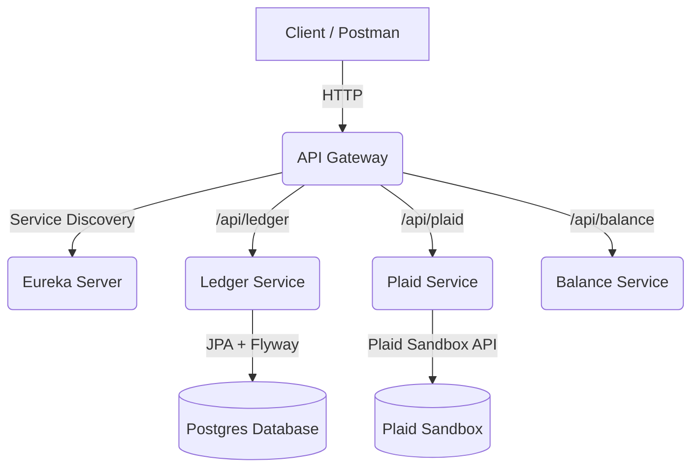

# 🧩 Balance Predictor

[](https://github.com/pa-mi-su/balance-predictor/actions/workflows/ci.yml)
[]()
[](LICENSE)
[]()
[]()
[]()

> **Balance Predictor** is a **microservices-based financial forecasting system** that predicts future account balances by combining **Plaid banking data** with **user transaction history**.  
> Built with **Java 17**, **Spring Boot**, **Spring Cloud Eureka**, **Docker**, and **PostgreSQL**, it models the architectural principles found in real-world enterprise platforms.

---

## 🌟 Highlights

| Capability | Description |
|-------------|--------------|
| 🧭 **Microservice Architecture** | Independent services (Ledger, Balance, Plaid, Gateway, Eureka) communicating through REST + Service Discovery. |
| 🔗 **Plaid Sandbox Integration** | Live connection to Plaid’s Sandbox API for token creation, exchange, and balance retrieval. |
| 🧮 **Balance Forecasting Engine** | Aggregates real account balances with ledger events to project future funds. |
| 🧱 **Persistent Ledger** | Durable event storage in PostgreSQL 16 using **Spring Data JPA** and **Flyway** migrations. |
| 🚪 **API Gateway** | Central entry point with **Spring Cloud Gateway** and Eureka-based load-balanced routing. |
| ⚙️ **Docker-Compose Stack** | One-command startup for all containers (Eureka, Postgres, Ledger, Plaid, Balance, Gateway). |
| 📘 **Swagger + Postman** | Auto-documented APIs and one-click end-to-end testing via a bundled Postman collection. |
| 🔄 **Idempotent Writes** | Guaranteed safe re-submission of events via app- and DB-level deduplication. |
| 🧰 **CI/CD Ready** | Automated builds and multi-service Docker image packaging with GitHub Actions. |

---

## 🧠 Why This Project

Modern personal finance apps struggle with delayed balance updates and poor forecasting. **Balance Predictor** bridges that gap by:
- Synchronizing live Plaid balances with user-recorded ledger events.
- Calculating short-term projections to prevent overdrafts.
- Demonstrating a full microservice pattern with service discovery, resilience, and observability baked in.

This project serves as a **portfolio-ready reference architecture** for cloud-native Java developers.

---

## 🧭 Architecture Overview



### ⚙️ Service Ports

| Service | Port | Purpose |
|----------|------|----------|
| **Eureka Server** | `8761` | Service registry |
| **API Gateway** | `8081` | Single ingress for clients |
| **Balance Service** | `8080` | Projection engine |
| **Ledger Service** | `8082` | Persistent events |
| **Plaid Service** | `8083` | Sandbox bank integration |
| **Postgres** | `5432` | Shared relational database |

---

## 🐳 Quick Start (Docker Compose)

```bash
docker compose down -v
docker compose up -d --build
curl http://localhost:8081/actuator/health
```

### Verify All Services

```bash
docker compose ps
```
Expected healthy state:
```
NAME                                STATUS
api-gateway                         healthy
ledger-service                      healthy
plaid-service                       healthy
balance-service                     healthy
eureka-server                       healthy
postgres                            healthy
```

### Test Routes
```bash
# Add a ledger event
curl -fsS -X POST "http://localhost:8081/api/ledger/events?userId=1"   -H "Content-Type: application/json"   -d '[{"date":"2025-10-08","amount":-42.50,"description":"Sanity check"}]' | jq

# Get all events
curl -fsS http://localhost:8081/api/ledger/events?userId=1 | jq
```

---

## 🧮 Idempotent Ledger Writes

Duplicate financial events can wreak havoc on projections.  
**Ledger Service** guarantees **idempotency** both at the application and database level.

```sql
CREATE UNIQUE INDEX uq_pending_events_natural
  ON pending_events(user_id, event_date, amount, description);
```

- **App Guard:** `existsByUserIdAndDateAndAmountAndDescription()` prevents duplicates before insert.  
- **DB Constraint:** unique index ensures absolute integrity.  
- **Result:** safe retries, durable writes, consistent projections.

---

## 🔧 Developer Notes

### Recommended JVM Flags
```bash
JAVA_TOOL_OPTIONS="-XX:MaxRAMPercentage=75 -XX:+ExitOnOutOfMemoryError"
```

### Compose Dependencies
Add `depends_on: condition: service_healthy` in your `docker-compose.yml` for predictable startup order:
```
ledger-service:
  depends_on:
    eureka-server:
      condition: service_healthy
    postgres:
      condition: service_healthy
```

### Hibernate Optimization
```
spring.jpa.open-in-view=false
```

---

## 📊 Observability

| Tool | Description |
|------|--------------|
| **Spring Actuator** | `/actuator/health`, `/actuator/info`, `/actuator/gateway/routes` for discovery & health. |
| **Micrometer / Prometheus** | Ready for metrics collection and dashboarding. |
| **Resilience4j (Optional)** | Add for retries, circuit breaking, and fallback patterns. |

---

## 🛠️ Local Development Makefile

```makefile
up:
	docker compose up -d --build

down:
	docker compose down

nuke:
	docker compose down -v
	rm -rf target

logs:
	docker compose logs -f --tail=100
```

---

## 👩‍💻 Tech Stack

| Layer | Tech |
|-------|------|
| Language | Java 17 |
| Framework | Spring Boot 3.3.3 |
| Service Discovery | Spring Cloud Eureka 2023.0.3 |
| API Gateway | Spring Cloud Gateway |
| Database | PostgreSQL 16 + Flyway |
| Persistence | Spring Data JPA + HikariCP |
| Containerization | Docker + Compose |
| Testing | Postman + cURL + Testcontainers (future) |
| CI/CD | GitHub Actions |
| Docs | Swagger UI + Markdown |

---

## 🔍 Next Steps
- [ ] Add Testcontainers-based integration test for Ledger Service
- [ ] Add Grafana/Prometheus docker service for observability
- [ ] Add screenshot of Plaid Sandbox flow in README
- [ ] Include architecture diagram badge at top

---

## 📜 License

This project is licensed under the **MIT License**.
